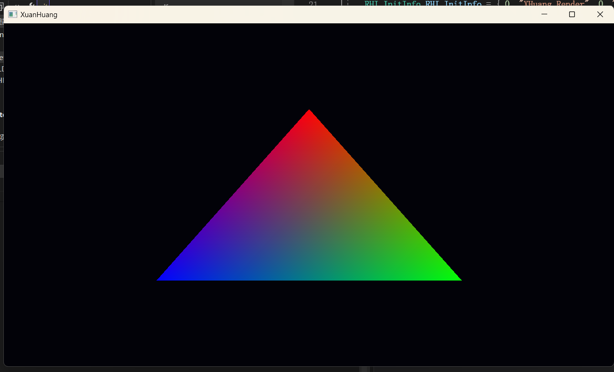

# XHuang
渲染引擎，玄黄——天地色也。

* 学习图形API —— Vulkan
* 学习工程组织构建 —— Cmake

## 工程构建
目前只支持 Windows。
### Windows （Visual Studio 2022）

命令行或点击运行 **build_vs_project.bat**

## 学习进度 （2024/01/08）
对Vulkan相关概念进行了抽象封装，遵循RAII原则对Vulkan对象进行管理，目前成功画出了三角形。

